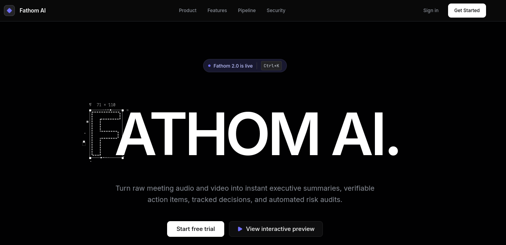
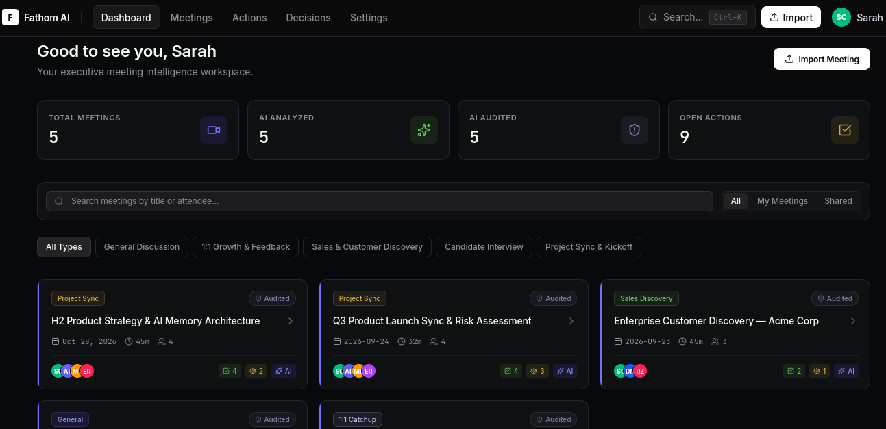
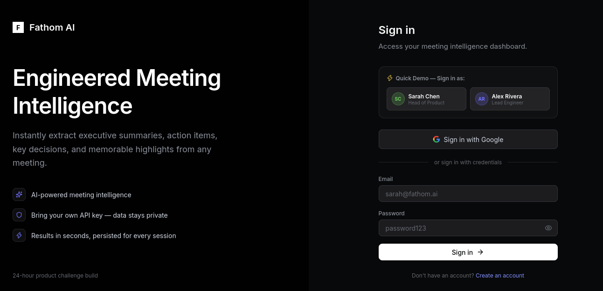
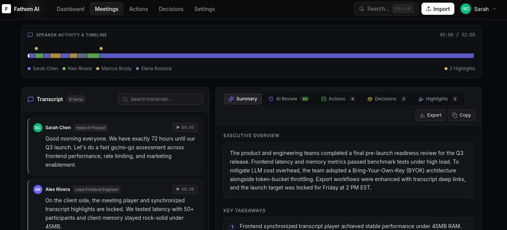
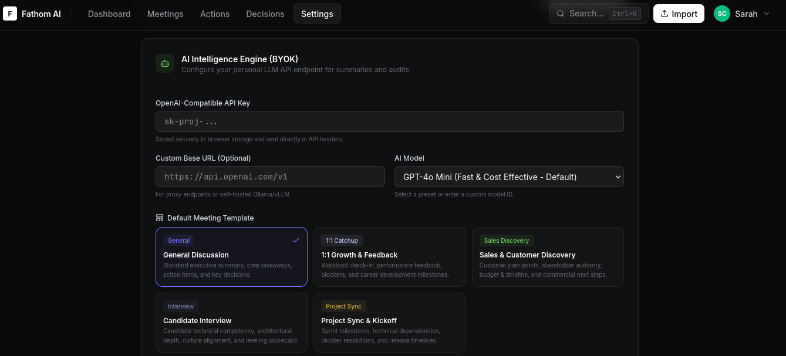
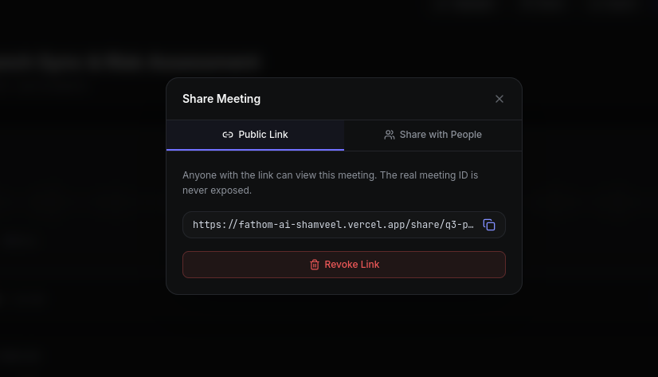
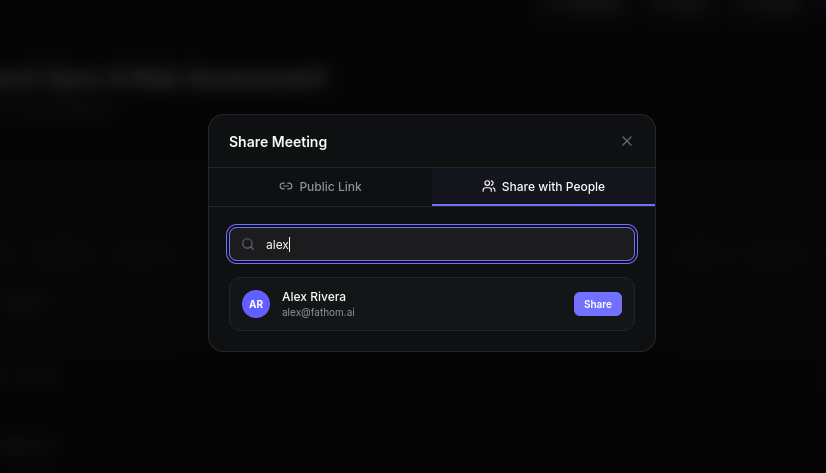

# Fathom AI Clone

Fathom AI Clone is a meeting intelligence workspace built with Next.js, React, TypeScript, and PostgreSQL. It turns meeting imports into summaries, decisions, action items, reviews, and shareable read-only meeting views.

## What It Does

- Landing page with a product preview, call to action, and feature overview.
- Auth flow for sign in and sign up.
- Dashboard with meeting stats, recent activity, and import actions.
- Meetings library with grid and dense views, search, and template filters.
- Meeting detail workspace with transcript, timeline, analysis, and export tooling.
- Decisions and action items views for tracking outcomes from meetings.
- Settings for profile data, AI configuration, and default meeting template.
- Public share links for read-only meeting access.

## Screenshots

The screenshots below come from the captured assets in `pics/`.

| Landing Page | Dashboard |
| --- | --- |
|  |  |

| Login | Meeting Workspace |
| --- | --- |
|  |  |

| Settings | Share View 1 |
| --- | --- |
|  |  |

| Share View 2 |
| --- |
|  |

The `/pics` folder currently contains all available screenshots for the landing page, login, dashboard, meeting workspace, settings, and two share views.

## Tech Stack

- Next.js App Router
- React 19
- TypeScript
- Tailwind CSS 4
- PostgreSQL via Neon
- OpenAI-compatible AI providers
- Zod schema validation

## Getting Started

### Prerequisites

- Node.js 20 or newer
- A PostgreSQL database
- Optional: OpenAI API key or another OpenAI-compatible endpoint

### Environment Variables

Create a `.env.local` file from `.env.example` and fill in the values below:

- `DATABASE_URL`
- `OPENAI_API_KEY`
- `OPENAI_BASE_URL`
- `AUTH_SECRET`
- `GOOGLE_CLIENT_ID`
- `GOOGLE_CLIENT_SECRET`
- `GOOGLE_REDIRECT_URI`

### Install

```bash
npm install
```

### Run Locally

```bash
npm run dev
```

Open http://localhost:3000 in your browser.

### Database

Run migrations and optional seed data with:

```bash
npm run db:migrate
npm run db:seed
```

## Available Scripts

- `npm run dev` - start the development server
- `npm run build` - build the production app
- `npm run start` - run the production build
- `npm run lint` - run ESLint
- `npm run db:migrate` - run database migrations
- `npm run db:seed` - seed sample data

## Main Routes

- `/` - landing page
- `/login` and `/signup` - authentication pages
- `/dashboard` - workspace overview
- `/meetings` - meetings library
- `/meetings/[id]` - meeting workspace
- `/action-items` - action items view
- `/decisions` - decision log
- `/settings` - profile and AI settings
- `/share/[token]` - public shared meeting view

## Notes

- The product supports both imported meetings and shared meetings.
- AI settings can be configured per user in the app UI.
- The public share view is read-only and does not require authentication.

